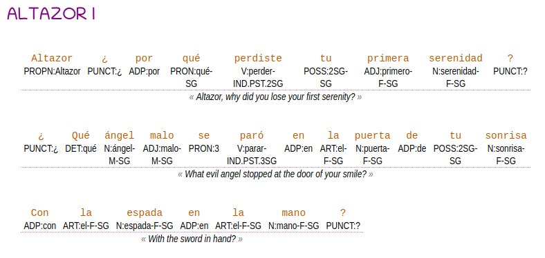

# Automatic linguistic glosser for spanish

> online: https://alerojorela.neocities.org/morphology/glosses/gloss_viewer

This program creates glosses from spanish automatically and renders them.

- A **python program** uses and manipulates:
	- **morphology** provided by [Spacy](https://spacy.io/)
	- **automatic translation** from spanish to english provided by a large language model called [Llama 2](https://huggingface.co/meta-llama/Llama-2-7b-chat-hf).
	
	> Click [here](https://github.com/alerojorela/NLP-scripts/tree/main/API) for setup instructions.
	
- A **webpage** renders the resultant **json** file into tables, aligning words into columns.



## Use

```bash
python3 parser.py ./samples/altazor.txt 'Altazor I'
```

outputs to: `output.json`

## Syntax

- `POS:lemma` pair
- `-` concatenated morphemes
- `.` merged morphemes

## TO-DO

- [ ] English
- [ ] Other notations
